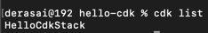
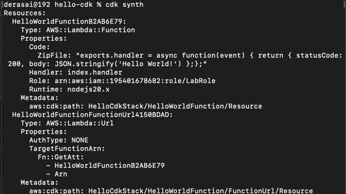
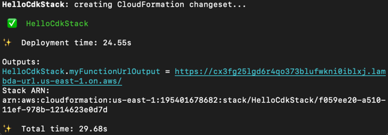
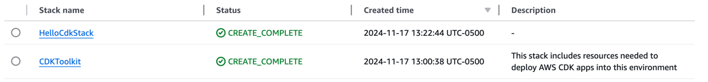
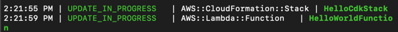
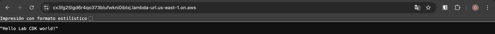

# Proyecto CDk con Java
Este es un proyecto básico usando CDK, la cual es una herramienta de AWS, para poder hacer el despliegue
de manera simple de una lambda en la web.

Este proyect usa Maven como base, asegurate de que tu IDE sea compatible con Java y Maven para hacer el build y 
correr los test correctamente.

# Tecnologias / Prerrequisitos

- Apache Maven
- GIT
- Java
- Node
- AWS CLI
- AWS CDK CLI

## Comandos útiles

 * `mvn package`     compile and run tests
 * `mvn compile`     just compile the app
 * `cdk ls`          list all stacks in the app
 * `cdk synth`       emits the synthesized CloudFormation template
 * `cdk deploy`      deploy this stack to your default AWS account/region
 * `cdk diff`        compare deployed stack with current state
 * `cdk docs`        open CDK documentation

# Arquitectura

Se genera un cloud formation donde internamnte se tiene un servicio lambda básico, el cual su única función es 
retornar un `Hello World` mediante una respuesta HTTP con un estado 200.

# Explicación

## Inicialización
Inicializamos configurando nuestra cuenta de AWS asociada, junto a la región que queremos usar.

`aws sts get-caller-identity --query "Account" --output text`

`aws configure get region`

Justo despues inicializamos una aplicación vacía de CDK

`cdk init app --language java`

Como tenemos una cuenta de AWS Academy tenemos que hacer algunos modificaciones en el proyecto para poder hacer el despliegue correctamente y sin errores

Primero inicializamos una template de bootstrap para poder cambiar todo el tema de roles (que es lo que nos genera problema por el tipo de cuenta que tenemos)

`cdk bootstrap --show-template > bootstrap-template.yaml`

Aquí hacemos comentamos todo lo que tenga que ver con roles y lo cambiamos de ser necesario en el archivo `bootstrap-template.yaml` 
como se puede apreciar en el repositorio desde la línea 272 hasta 569. Y en la línea 159 lo cambiamos por `Fn::Sub: "*"` 

Seguido a esto inicializamos el CDK usando la plantilla que acabamos de crear.

`cdk bootstrap --template bootstrap-template.yaml`

En el código de manera estática agregamos la incialización de la Lambda junto a su configuración básica para generar el URL,
esta configuración la puedes ver en el archivo `HelloCdkStack.java`, aquí es importante notar que se hizo una modificación para
indicarle a la lambda con cúales roles debía inicializarse.

Realizamos la compilacón del proyecto

`mvn clean compile`

Realizamos la síntesis del proyecto para prerar el despliegue

`cdk synth`

Finalmente realizamos el despliegue si todo salió sin errores en el paso anterior

`cdk deploy -r arn:aws:iam::195401678682:role/LabRole`

Cuando este comando termine de ejecutarse se generará un Link en la consola, este link te llevará a la eecución de tu lambda desplegada

# Evidencias

CDK list

CDK synth

Deployment mediante consola

Creación de ambos cloud formation

Despliegue actualizando mensaje

Mensaje personalizado consultando la URL

# Version
1.0

# Author
Daniel Esteban Ramos Jimenez
